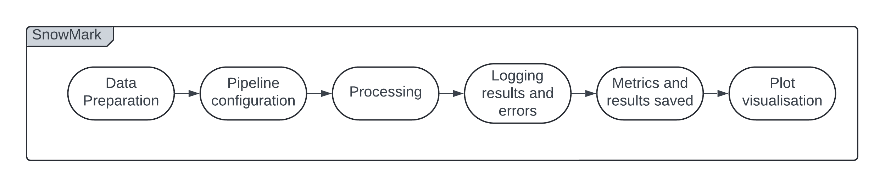
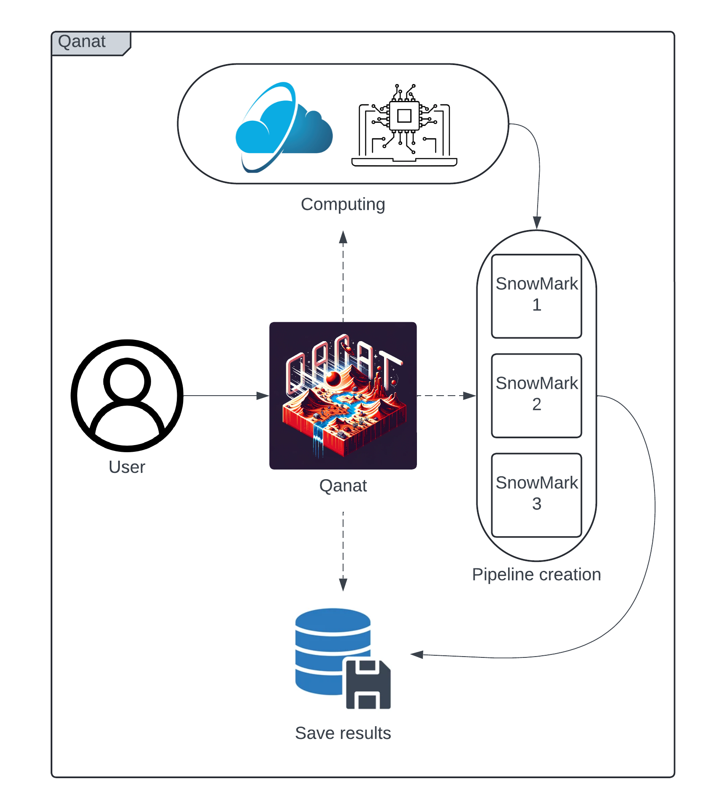

.. _introduction:

SnowMark Introduction
================
Why We Use SnowMark
-------------------

Overview
^^^^^^^^
Welcome to the documentation for the Wet Snow Detection framework for benchmarking machine learning models: *SnowMark*. This document provides a comprehensive introduction to the project, detailing its key features, operation, and usage guidelines to help users effectively utilize the framework.

Introduction
^^^^^^^^^^^^
SnowMark is designed to streamline the creation of pipelines for benchmarking various machine learning models in the detection of wet snow. It leverages advanced technologies for data management, job processing, and experiment management to ensure efficient and reproducible results across multiple runs.

The framework allows users to generate multiple runs of training and testing using different machine learning models based on the `scikit-learn` (sklearn) library. By standardizing metrics, SnowMark simplifies the process of benchmarking and comparing models, making it easier to identify the most effective solutions.

Key Features
^^^^^^^^^^^^
- **Benchmarking**: Enables the deployment of multiple experiments with various ML models on the same dataset. This facilitates easy benchmarking and comparison to determine the most effective model for wet snow detection.
- **Customization**: Offers extensive options for selecting balancing methods, labeling strategies, and more. Users can create diverse tests with different data configurations and experimental setups, tailoring the framework to specific research needs.
- **Dataset Flexibility**: While SnowMark currently supports a specific type of dataset, its modular design allows for easy adaptation to accommodate other dataset types, enabling broader applicability.
- **Scalability**: The framework is designed to handle large-scale experiments by utilizing parallel processing, making it suitable for both small-scale tests and extensive research projects.

Framework Functioning
^^^^^^^^^^^^^^^^^^^^^
The following sections outline the operation of the SnowMark framework, detailing its core processes and features.

1. **Data Preparation:**
   - Data loading and preprocessing methods are configured for shuffling, labeling, and balancing. This ensures that the data is ready for effective training and testing.
   - The dataset is split into training and testing sets based on user-defined cross-validation strategies, enabling robust model evaluation.

2. **Pipeline Configuration:**
   - Configured machine learning pipelines are applied to the data. These pipelines can be tailored through command-line configurations, offering flexibility and adaptability to different experimental needs.

3. **Parallel Processing:**
   - Parallel processing is employed for fitting and predicting across multiple data folds. This ensures efficient model training and prediction by optimizing resource usage and reducing computation time.

4. **Logging and Error Handling:**
   - All training and prediction metrics are logged, including time tracking for each operation. This transparency ensures that results are reproducible and can be thoroughly analyzed.
   - Errors encountered during execution are logged with detailed information, facilitating debugging and improving the robustness of the framework.

5. **Metrics and Results:**
   - Metrics collected for each fold are aggregated to provide a comprehensive overview of model performance. This data is crucial for understanding the effectiveness of different models and configurations.
   - Results, including predictions and metrics, are saved for further analysis and visualization, allowing users to dive deeper into their experimental outcomes.

6. **Visualization:**
   - Generated plots, such as boxplots and ROC curves, offer visual insights into model performance. These visualizations are key to interpreting results and comparing different models or configurations.

Execution Flow
^^^^^^^^^^^^^^
The framework follows a systematic execution flow to ensure organized and reproducible experiments:

1. **Initialization:**
   - Logging and storage paths are set up, and the dataset is prepared for processing. This initial setup is critical for ensuring that the experiment runs smoothly.

2. **Model Training and Prediction:**
   - Models are trained and evaluated using cross-validation techniques, ensuring that the evaluation is robust and the results are reliable.
   - Trained models are saved in `joblib` format, and results are stored in `pickle` format for easy access and further analysis.

3. **Post-Processing:**
   - Final metrics are reported, and visualizations are generated. These outputs provide insights into model performance and help guide future experiments, ensuring that research progresses in an informed manner.

Why We Use Qanat
----------------
SnowMark has been developed with the goal of providing users with maximum flexibility when deploying experiments. However, as the number of experiments increases, managing and organizing the results becomes more complex. This is where `Qanat` comes into play.

Qanat is a minimal CLI-based experiment tracking tool designed to run, monitor, and analyze command-line programs. In the context of SnowMark, Qanat enhances the user experience by providing additional flexibility to deploy multiple experiments simultaneously and efficiently manage the use of containers and job systems.

Qanat's Structure and Functionality
^^^^^^^^^^^^^^^^^^^^^^^^^^^^^^^^^^^

Qanat operates through console command lines, allowing users to set parameters and deploy experiments seamlessly. Once configured, Qanat creates a set of SnowMark pipelines, each with user-defined parameters. It then manages either multi-processing or single-processing for all the pipelines under study.

Qanat also handles the storage and organization of all experiment data over time. Users can access these records via the Qanat console, providing them with the necessary information to compare different studies effectively. This structured approach ensures that results are not only reproducible but also easily accessible for ongoing research and analysis.

In summary, Qanat’s integration with SnowMark empowers users to efficiently manage large-scale experiments, track their progress, and analyze results, thereby enhancing the overall research workflow.
