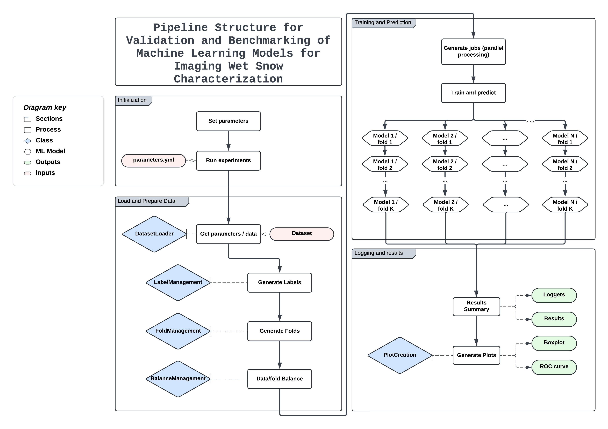

=====
Usage
=====

This framework is a powerful and adaptable tool for studying and comparing different machine learning models. Its modular design allows users to easily customize and extend its functionalities to meet specific needs.

.. raw:: html

   <h2>Main Components</h2>

.. raw:: html

   <h4>1. Data Loading and Preprocessing (`dataset_load`)</h4>

- **Purpose**: Manages the loading and preprocessing of datasets to prepare them for modeling.

- **Key Features**:
   - Supports multiple data formats: CSV, JSON, Excel.
   - Data preparation: cleaning, normalization, transformation to ensure consistent quality.
   - Integration with libraries like Pandas and Scikit-learn for data manipulation.

- **Adaptability**: This module can be extended to accommodate new data sources and specific preprocessing needs.

.. raw:: html

   <h4>2. Label Management (`label_management`)</h4>
- **Purpose**: Creates and manages labels for the dataset, a crucial element for supervised learning tasks.

- **Key Features**:
   - Supports binary, multi-class, and multi-label tagging.
   - Label encoding: converts categorical labels into numeric formats suitable for training.
   - Custom label generation based on user-defined rules and conditions.

- **Adaptability**: Easily adjustable to different types of datasets and experimental objectives, with the ability to define new labeling schemes and encoding strategies.

.. raw:: html

   <h4>3. Fold Management for Cross-Validation (`fold_management`)</h4>
- **Purpose**: Organizes the splitting of data into training and testing sets using various cross-validation strategies to ensure robust model evaluation.

- **Key Features**:
   - K-Fold Cross-Validation: evaluates model performance by dividing the dataset into K subsets and rotating which subset is used for testing.
   - Simple splits: methods for straightforward data partitions based on a specific proportion.
   - Sophisticated splits based on metadata, including stratified and combination-based approaches.

- **Adaptability**: Customizable to accommodate different data structures and experimental requirements, with user-defined data splitting strategies.

.. raw:: html

   <h4>4. Data Balancing Management (`balance_management`)</h4>
- **Purpose**: Addresses class imbalances in datasets to ensure fair model training and evaluation.

- **Key Features**:
   - Oversampling: employs techniques like Random Oversampling and SMOTE to increase instances in minority classes.
   - Undersampling: reduces instances in majority classes to achieve a more balanced dataset.
   - Class balance evaluation metrics before and after resampling.

- **Adaptability**: Flexible in choosing different balancing strategies to fit the specific characteristics of the dataset and experimental goals. Users can also integrate new resampling methods.

.. raw:: html

   <h4>5.  Result Visualization (`figures`)</h4>      
- **Purpose**: Provides clear visualization of results to facilitate the analysis and interpretation of model performance.

- **Key Features**:
   - Generates customizable plots, including boxplots for metric distributions and ROC curves for performance evaluation.
   - Visual tools to compare model performance across different metrics and folds, helping to identify strengths and areas for improvement.
   - Customization of plots: aesthetics, titles, and labels according to analytical needs.
   - Saving and managing plots for simplified future analysis.

- **Adaptability**: Allows the addition of new types of plots and visualizations. Users can define custom plotting functions to meet specific analysis needs and save them in designated directories.

.. raw:: html

   <h2>Running a Module</h2>

Running `SnowMark.py` from the console can be complex due to the number of required parameters. Here is an example command:

.. code-block:: shell

   python evaluation/learning_models.py \
     --data_path <data_path> \
     --fold_method <fold_method> \
     --labeling_method <labeling_method> \
     --balancing_method <balancing_method> \
     --request <request_condition> \
     --shuffle_data <shuffle_data_boolean> \
     --balance_data <balance_data_boolean> \
     --import_list <import_statement1> \
     --import_list <import_statement2> \
     --pipeline <pipeline_step1> \
     --pipeline <pipeline_step2> \
     --pipeline <pipeline_step3> \
     --metrics_to_report <metric1> \
     --metrics_to_report <metric2> \
     --metrics_to_report <metric3> \
     --metrics_to_report <metric4> \
     --seed <seed_value> \
     --storage_path <storage_path>

To simplify this process, you can use **Qanat**. Qanat allows you to specify all parameters in a single YAML file. It then generates the appropriate command and launches all the experiments for you.

.. toctree::
   :maxdepth: 1

   ./run_exp 
   ./parameter_files
   ./templates
   ./saved_info
   ./saved_imgs